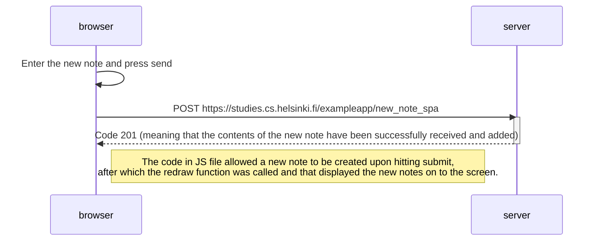

Fullstack Challenge exercise 0.6

```mermaid
sequenceDiagram
    participant browser
    participant server

    browser->>browser: Enter the new note and press send

    browser->>server: POST https://studies.cs.helsinki.fi/exampleapp/new_note_spa
    activate server
    server-->>browser: Code 201 (meaning that the contents of the new note have been successfully received and added)
    deactivate server

    Note right of browser: The code in JS file allowed a new note to be created upon hitting submit,<br> after which the redraw function was called and that displayed the new notes on to the screen.
```